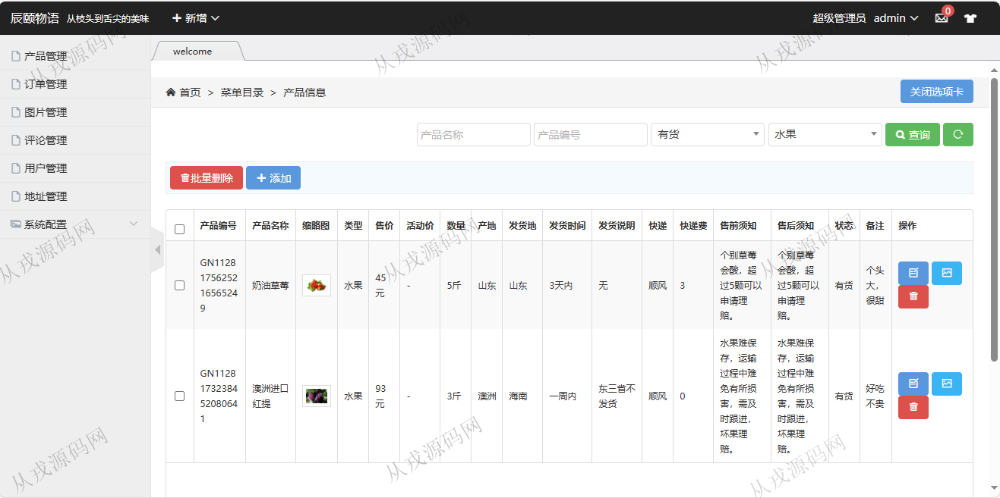
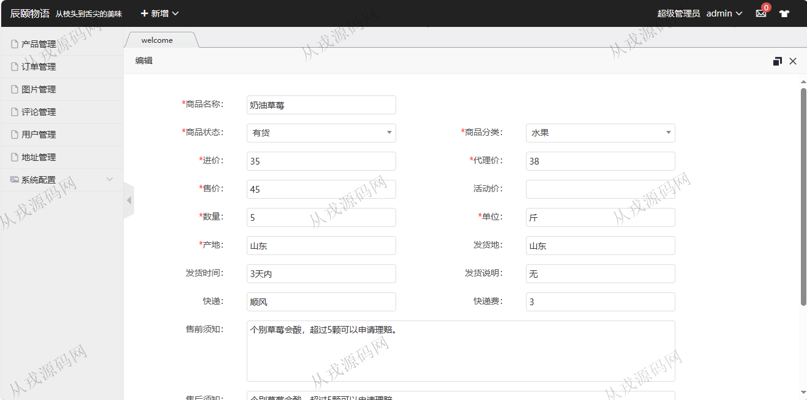
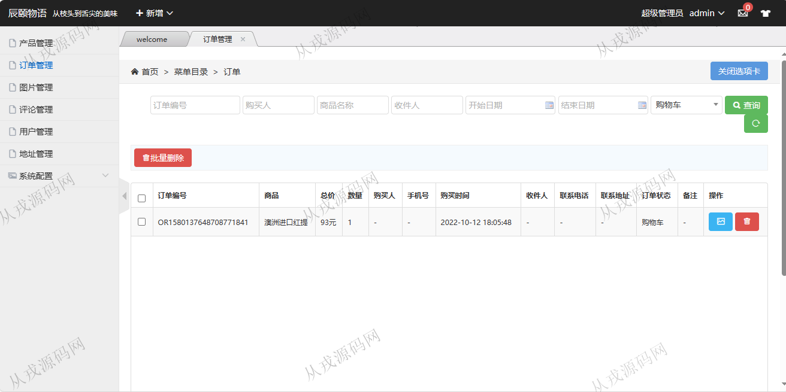
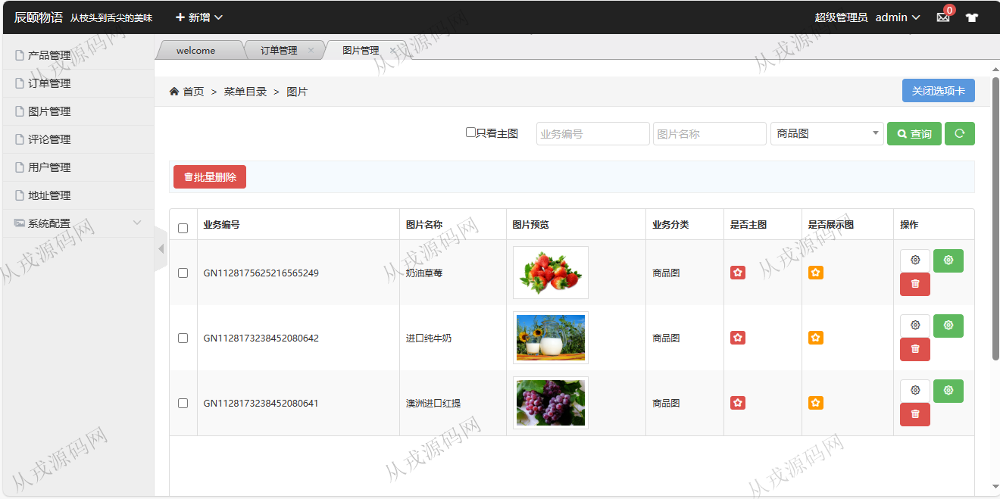
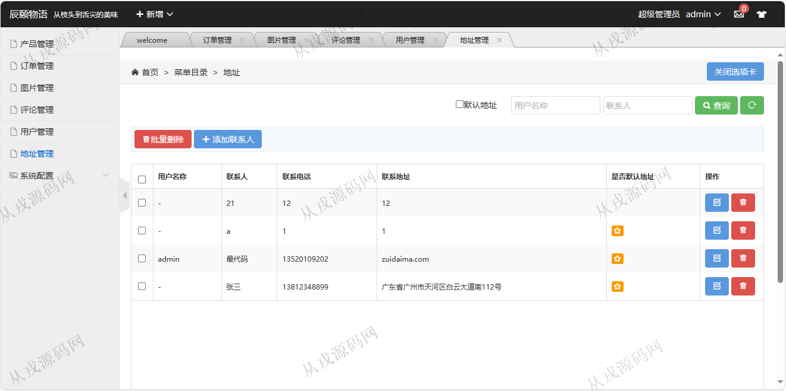
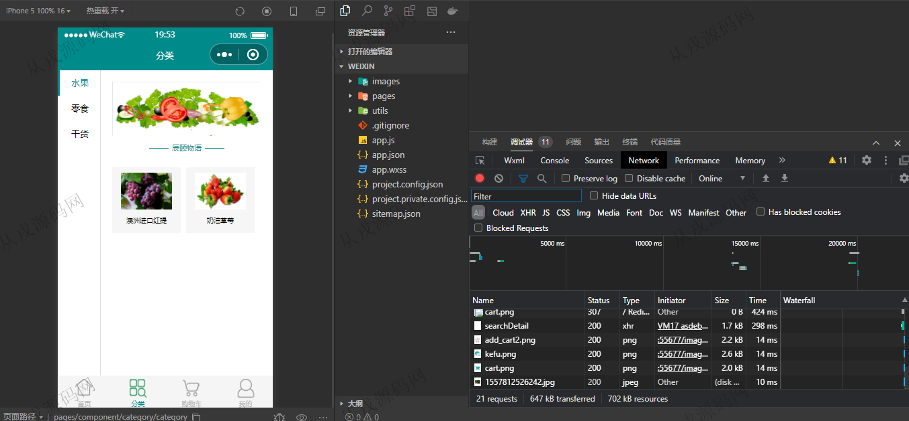
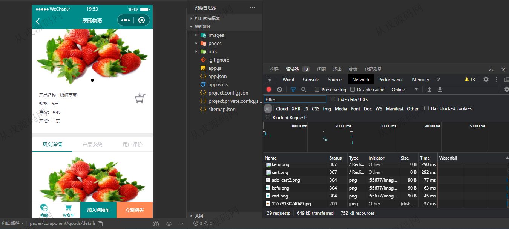
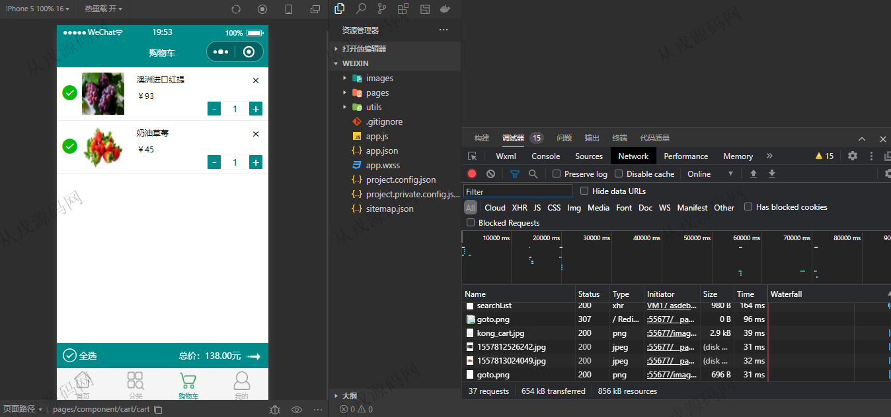
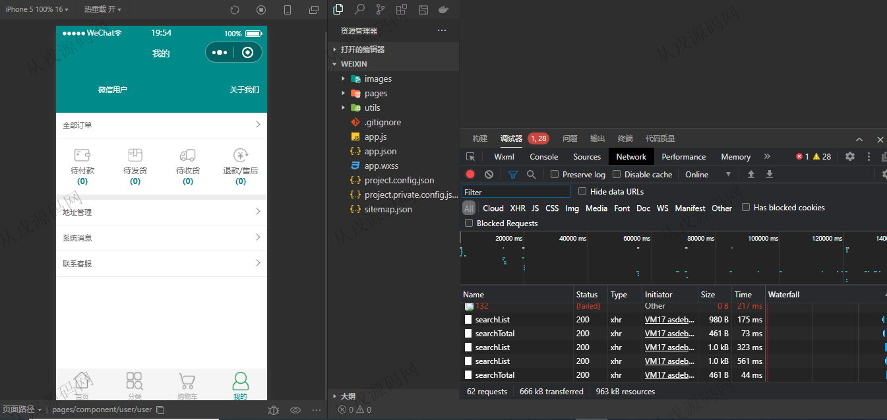

<h1 align="center">192.微信小程序购物商城管理系统</h1>

 获取sql文件 QQ: 386869957 QQ群: 377586148 

 [更多源码项目: 从戎源码网](https://armycodes.com/) 

## 简介

> 本代码来源于网络,仅供学习参考使用!
>
> 提供1.远程部署/2.修改代码/3.设计文档指导/4.框架代码讲解等服务
> 
> http://localhost:8080/public/login/index.html 登录账号：13812348899 -> 111111
> 
>

## 项目介绍
基于小程序+分布式购物商城管理系统：前端 html、jquery、小程序，后端 maven、springmvc、spring、dubbo、mybatis；角色分为管理员、用户；集成微信小程序用户浏览商品下单，购物车，在线结算等功能于一体的系统。

## 功能介绍

### 小程序

- 首页：轮播图，在售商品展示，内容搜索
- 分类：分类导航，商品列表展示
- 商品购买：商品详情，购买，加入购物车，购物车列表，在线结算，在线支付（模拟）
- 我的：订单查询，地址管理，系统消息，联系客服

### 管理后台

- 产品管理：产品信息的增删改查，产品图片上传，多条件搜索
- 订单管理：订单信息的增删改查，多条件搜索
- 图片管理：图片信息的列表查询，设置为主图，设置为展示图，删除
- 评论管理：评论信息的列表查询，评论回复
- 用户管理：用户信息的增删改查
- 地址管理：地址信息的增删改查
- 系统配置：访问日志，发布通知，数据字典

## 环境

- <b>IntelliJ IDEA 2021.3</b>

- <b>Mysql 5.7.26</b>

- <b>Tomcat 7.0.73</b>

- <b>JDK 1.8</b>

- <b>redis 3.0</b>

- <b>微信开发者工具</b>

## 运行截图

